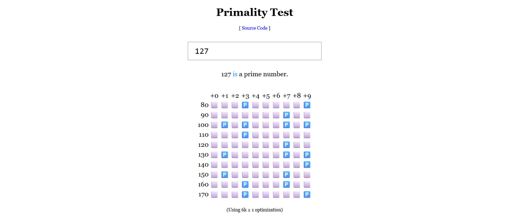

# Primality Test 

<big>[Live Demo here!](https://hnthap.github.io/primality/)</big>

Minimal Primality Test website implemented with just a HTML file, a CSS file and a JavaScript file. This can check for prime numbers up to 1012.
